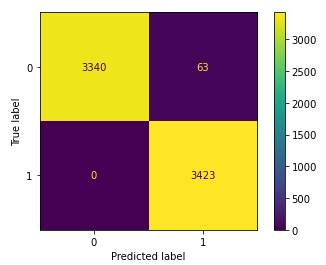
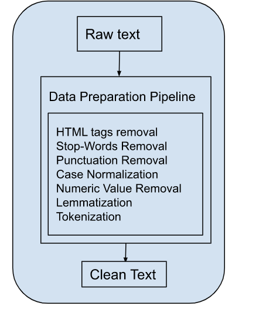
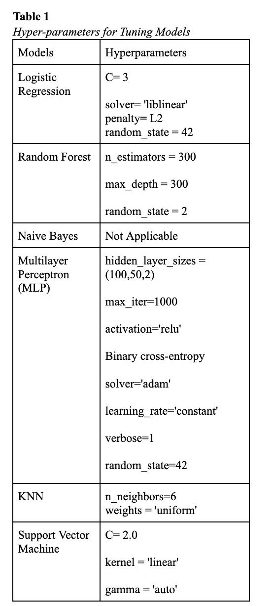
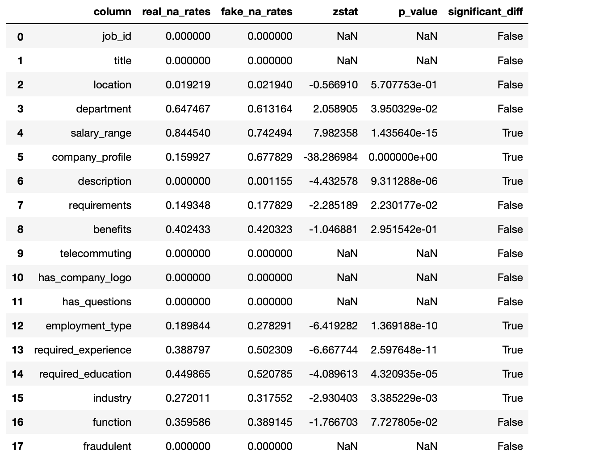

# 🔍 Fake Job Posting Detection System

A machine learning-powered web application that detects fraudulent job postings using natural language processing and optical character recognition (OCR). The system can analyze both text input and uploaded job posting images to identify potentially fake job Posting Advertisements.

## 🌟 Features

- **Text Analysis**: Analyze job descriptions entered manually
- **Image Processing**: Extract text from job posting images using OCR
- **Machine Learning Detection**: Uses trained ML model to classify job postings as legitimate or fraudulent
- **Modern Web Interface**: Beautiful, responsive web UI with gradient backgrounds and animations
- **Real-time Results**: Instant classification with visual feedback
- **File Upload Support**: Supports multiple image formats (JPEG, PNG, GIF, BMP, TIFF)

## 🖼️ Screenshots

The application includes sample job postings in the `Job Posters/` directory:
- Examples of real job postings
- Examples of fake job postings for testing

## 🛠️ Technology Stack

- **Backend**: Flask (Python web framework)
- **Machine Learning**: scikit-learn with TF-IDF vectorization
- **OCR**: Tesseract-OCR with pytesseract
- **Image Processing**: PIL (Python Imaging Library)
- **Frontend**: HTML, CSS, JavaScript with modern UI design
- **Model Persistence**: joblib for saving/loading trained models

## 📋 Prerequisites

### System Requirements
- Python 3.7+
- Tesseract-OCR installed on your system

### Tesseract-OCR Installation
- **Windows**: Download from [UB-Mannheim Tesseract](https://github.com/UB-Mannheim/tesseract/wiki)
- **macOS**: `brew install tesseract`
- **Linux**: `sudo apt-get install tesseract-ocr`

## 🚀 Installation

1. **Clone the repository**
   ```bash
   git clone https://github.com/yourusername/fake-job-posting-detection.git
   cd fake-job-posting-detection
   ```

2. **Install Python dependencies**
   ```bash
   pip install flask pytesseract pillow joblib pandas numpy matplotlib seaborn nltk scikit-learn==1.3.2 imbalanced-learn==0.11.0
   ```

3. **Configure Tesseract path** (Windows users)
   - Update the Tesseract path in `app.py` if your installation directory differs:
   ```python
   pytesseract.pytesseract.tesseract_cmd = r'C:\Program Files\Tesseract-OCR\tesseract.exe'
   ```

4. **Run the application**
   ```bash
   python app.py
   ```

5. **Access the web interface**
   - Open your browser and navigate to `http://localhost:5000`

## 📁 Project Structure

```
Fake Job Posting/
├── app.py                          # Main Flask application
├── templates/
│   └── index.html                  # Web interface template
├── Trained Model/
│   ├── fake_job_model.pkl          # Trained ML model
│   └── tfidif_vectorizer.pkl       # TF-IDF vectorizer
├── Data/
│   ├── fake_job_postings.csv       # Original dataset
│   └── clean_df                    # Processed dataset
├── Code Library/
│   ├── EDA.ipynb                   # Exploratory Data Analysis
│   └── ModelTraining.ipynb         # Model training notebook
├── Job Posters/
│   ├── Fake_Job1.jpg              # Sample fake job posting
│   ├── Fake_Job2.jpg              # Sample fake job posting
│   ├── Real_Job1.jpg              # Sample real job posting
│   └── Real_Job2.png              # Sample real job posting
├── Images/
│   ├── AUC_Curve_of ADASYN_TF-IDF.png    # ROC-AUC curve for model performance
│   ├── confusion_matrix_of_optimalmodel.png # Model confusion matrix
│   ├── data_preparation.png       # Data preprocessing workflow
│   ├── heatmap.png                # Feature correlation heatmap
│   ├── hyperparameters.png        # Hyperparameter tuning results
│   └── z-test.png                 # Statistical significance testing
└── README.md                       # Project documentation
```

## 🎯 Usage

### Text Input Method
1. Paste or type a job description in the text area
2. Click "Check" to analyze the posting
3. View the result (✅ Real Job or 🚨 Fake Job)

### Image Upload Method
1. Click "📸 Upload Job Poster" to select an image file
2. Choose a job posting image (supports JPEG, PNG, GIF, BMP, TIFF)
3. Click "Check" to extract text and analyze
4. View the classification result

### Combined Method
- You can use both text input and image upload simultaneously
- The system will combine the extracted text with manual input for analysis

## 🔬 Model Information

The detection system uses:
- **Algorithm**: Logistic Regression (C=3, solver='liblinear')
- **Feature Extraction**: TF-IDF (Term Frequency-Inverse Document Frequency) vectorization
- **Text Processing**: NLTK for natural language processing
- **Data Balancing**: Random Under Sampling for handling class imbalance
- **Performance**: Trained on a dataset of real and fake job postings

### Training Process
The model training process is documented in the Jupyter notebooks:
- `EDA.ipynb`: Exploratory data analysis and data visualization
- `ModelTraining.ipynb`: Model training, evaluation, and hyperparameter tuning

## 📊 Model Performance & Development

### Model Performance Metrics

**Confusion Matrix**  
Shows the model's prediction accuracy across true positives, false positives, true negatives, and false negatives:



**ROC-AUC Curve**  
ROC-AUC curve demonstrating the model's ability to distinguish between real and fake job postings:


### Model Development

**Data Preparation Workflow**  
Visual workflow of the data preprocessing pipeline:



**Hyperparameter Tuning Results**  
Results from hyperparameter tuning experiments:



**Statistical Significance Testing**  
Statistical significance testing results:



## 🚨 Fake Job Indicators

The model looks for common patterns in fraudulent job postings:
- Unrealistic salary promises
- Requests for personal/financial information upfront
- Vague job descriptions
- Immediate hiring without interviews
- Work-from-home schemes with minimal requirements
- Urgent hiring language
- Poor grammar and spelling

## 📊 Example Job Postings

### ✅ Real Job Example
```
We are seeking a Data Analyst to join our analytics team in Bangalore. 
The candidate should have 2-4 years of experience in SQL, Python, and 
data visualization tools such as Power BI or Tableau. Responsibilities 
include analyzing data sets, generating reports, and providing actionable 
insights for business decisions. Competitive salary and benefits offered. 
Apply through our official company careers page.
```

### 🚨 Fake Job Example
```
URGENT HIRING! WORK FROM HOME! Earn ₹50,000 per week with no experience 
required! We only need your name, address, and bank details to set up 
your payment. Flexible hours, no interview, immediate start. 
LIMITED SPOTS — reply with your personal information today!
```

## ⚠️ Limitations

- OCR accuracy depends on image quality and text clarity
- Model performance is based on training data patterns
- May require updates as fraud techniques evolve
- Maximum file upload size: 16MB

## 📄 License

This project is licensed under the MIT License - see the [LICENSE](LICENSE) file for details.

## 👥 Author

- [Vignesh](https://github.com/M-VIG-NESH)

## 🙏 Acknowledgments

- Dataset sources for training the model
- Tesseract-OCR community for OCR capabilities
- Flask community for the web framework
- scikit-learn developers for machine learning tools

---

**⚠️ Disclaimer**: This tool is designed to assist in identifying potentially fraudulent job postings but should not be the sole method for verification. Always exercise caution and verify job opportunities through official channels.
